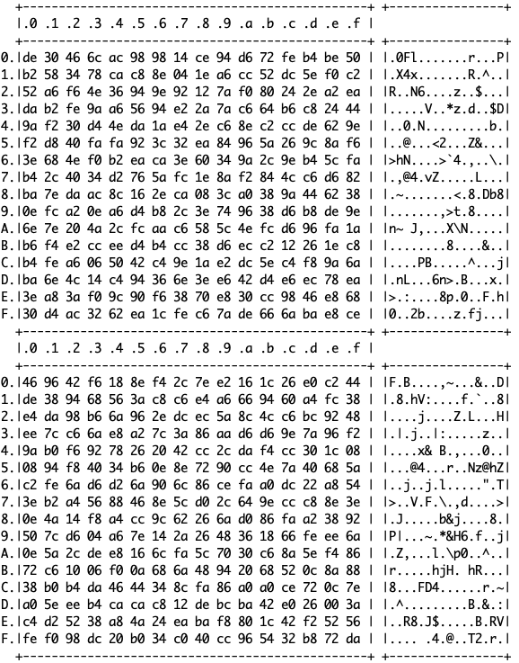

# BastWAN LoRa RNG

A project demonstrating how to generate random numbers on the BastWAN / RAK4260 using LoRa.

In this version the LoRa-based RNG code is in the LoRandom.h header file, and can be used anywhere. To use the `LoRandom.h` library in your code, you need to provide 2 functions:

  ```c
  void writeRegister(uint8_t reg, uint8_t value);
  uint8_t readRegister(uint8_t reg);
  ```

You need to call `void setupLoRandom()` at startup, and `uint8_t getLoRandomByte()` when you need a random byte. This code creates a stock of 256 bytes at startup to make things easier. Remember you need to reset LoRa settings when you need RNG...

This code is used in [BastWAN DHKE](https://github.com/Kongduino/BastWAN_DHKE) to provide random numbers for the public and private keys.

